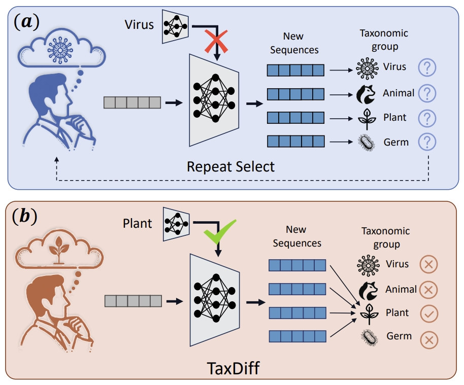
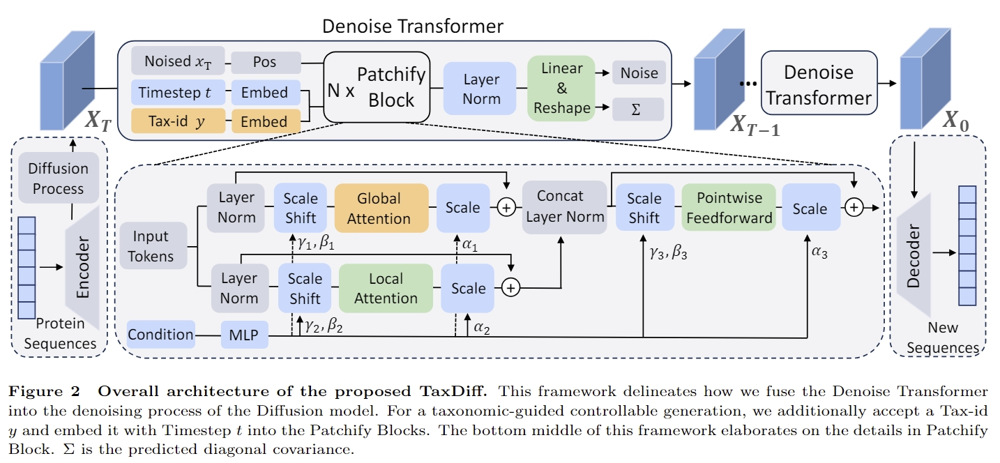

<p align="center">
    
<p>
<h5 align="center">
    The official code for "TaxDiff: Taxonomic-Guided Diffusion Model for Protein Sequence Generation", submitted to ICML2024. Here we publish the inference code of TaxDiff. The training code & Protein sequence with Taxonomic lables dataset will be released after our paper is accepted. If you like our project, please give us a star ⭐ on GitHub for latest update.
<h5 align="center">
    
[](https://arxiv.org/abs/2401.03403)
[](https://github.com/HowardLi1984/ECDFormer/blob/main/LICENSE)
[
[](https://github.com/HowardLi1984/ECDFormer/blob/main/DATASET_LICENSE) <br>

</h5>
<p align="center">
    
<p>
    

## Data Preparation
For inference, please download and put the [0012802.ckpt](https://github.com/Linzy19/TaxDiff/releases) into the folder ckpt/
```bash
ckpt/0012802.ckpt
```
We will release protein sequences with taxonmic labels for training procedure once our paper is accepted.

If you want to select a specific protein taxonomic for your research, you need to first find his corresponding  tax-id in the [data_reader/Taxonnmic_classfication.xlsx](https://github.com/Linzy19/TaxDiff/blob/main/data_reader/Taxonnmic_classfication.xlsx), and then modify protein class lables in the [sample_protein.py](https://github.com/Linzy19/TaxDiff/blob/main/sample_protein.py).
```bash
class_lables = torch.randint(low=1, high=int(23427), size=(1,num))
```


## 🛠️ Requirements and Installation
* Python == 3.10
* Pytorch == 2.2.0
* Torchvision == 0.17.0
* CUDA Version == 12.0
* Install required packages:
```bash
git clone git@[github.com/Linzy19/TaxDiff.git]
cd TaxDiff
pip install -r requirements.txt
```

## 🗝️ Inferencing
The inferencing instruction is in [sample_protein.py](sample_protein.py).
```bash
python sample_protein.py --model DiT-pro-12-h6-L16 --cuda-num cuda:0 --num 500
```

## ✏️ Citation
If you find our paper and code useful in your research, please consider giving a star :star: and citation :pencil:.

```BibTeX
@article{li2024deep,
  title={Deep peak property learning for efficient chiral molecules ECD spectra prediction},
  author={Li, Hao and Long, Da and Yuan, Li and Tian, Yonghong and Wang, Xinchang and Mo, Fanyang},
  journal={arXiv preprint arXiv:2401.03403},
  year={2024}
}
```
